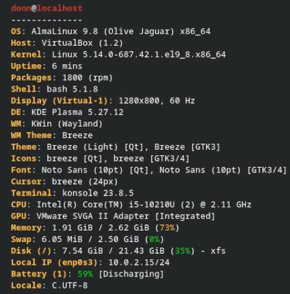
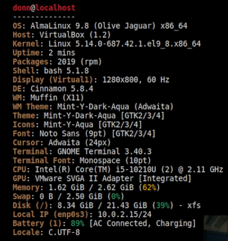
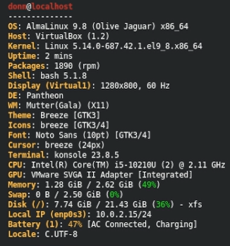

# AlmaLinux Desktop Environment Installation

## Overview

AlmaLinux 9 was installed using the Minimal ISO, which mean we initially only have the Command Line Interface or CLI Shell.

Before installing the additional desktop environments, the graphical environment and required repositories were configured.

### 1. Enable CRB

```bash
sudo dnf config-manager --set-enabled crb
```

### 2. Install EPEL

```bash
sudo dnf install epel-release -y
```

### 3. Check Available DNF Groups

```bash
sudo dnf group list
```

### 4. Install Server with GUI

```bash
sudo dnf groupinstall "Server with GUI" -y
```

### 5. Set Graphical Target as Default

```bash
sudo systemctl set-default graphical.target
```

The system was then rebooted to load the graphical login environment:

```bash
sudo reboot
```

After logging into the graphical environment, `fastfetch` was installed to display and verify system information.

```bash
sudo dnf install fastfetch -y
```

Fastfetch was then run with:

```bash
fastfetch
```

---

## 1. KDE Plasma

KDE Plasma was installed using:

```bash
sudo dnf groupinstall "KDE Plasma Workspaces"
```

The system was rebooted:

```bash
sudo reboot
```

KDE Plasma was selected from the login screen and verified with:

```bash
fastfetch
```



---

## 2. Cinnamon

Cinnamon was installed using:

```bash
sudo dnf install -y cinnamon* nemo
```

The system was rebooted:

```bash
sudo reboot
```

Cinnamon was selected from the login screen and verified with:

```bash
fastfetch
```



---

## 3. Pantheon

Pantheon was installed using:

```bash
sudo dnf groupinstall "Pantheon Desktop"
```

The system was rebooted:

```bash
sudo reboot
```

Pantheon was selected from the login screen and verified with:

```bash
fastfetch
```



---

## Summary

| Desktop Environment | Installation / Verification                                   |
| ------------------- | ------------------------------------------------------------- |
| KDE Plasma          | `sudo dnf groupinstall "KDE Plasma Workspaces"` → `fastfetch` |
| Cinnamon            | `sudo dnf install -y cinnamon* nemo` → `fastfetch`            |
| Pantheon            | `sudo dnf groupinstall "Pantheon Desktop"` → `fastfetch`      |
