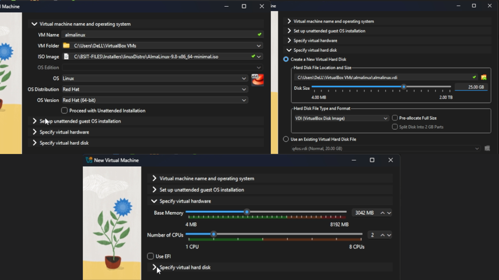
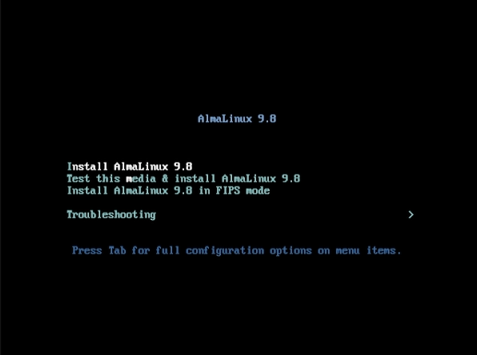
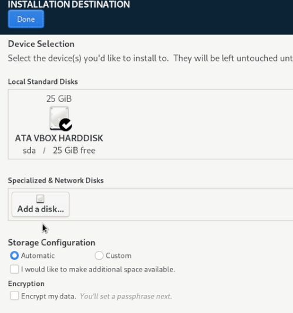
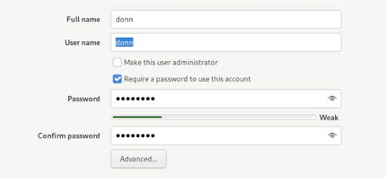
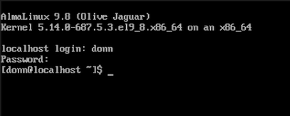

# AlmaLinux Installation

**Task:** Install AlmaLinux 9 (Minimal ISO) in VirtualBox for this lab to demonstrate Linux installation knowledge.

The Minimal ISO provides a minimal base system without a pre-installed desktop environment. Although the AlmaLinux installer uses a graphical interface, the installed system boots to a CLI-only environment. Desktop environments are installed in the next project phase using the terminal.

---

## 1. Virtual Machine Configuration

| Setting            | Value                   |
| ------------------ | ----------------------- |
| OS                 | AlmaLinux 9             |
| Installation Media | AlmaLinux 9 Minimal ISO |
| Architecture       | 64-bit                  |
| Memory             | 3 GB RAM                |
| Processors         | 2 CPU cores             |
| Storage            | 25 GB virtual disk      |
| Network            | NAT                     |

A dedicated VM keeps the installation isolated from the host system.

---

## 2. Boot the Installer

Mounted the AlmaLinux 9 Minimal ISO, started the VM, and launched the installer from the boot menu.

> The Minimal ISO is used to provide a minimal base installation without a pre-installed desktop environment. The installation process itself is performed using AlmaLinux's graphical installer.

---

## 3. Language, Location & Keyboard

Configured during setup:

* Language
* Location
* Keyboard layout
* Time zone

These settings establish the regional and input configuration for the installed system.

---

## 4. Disk Partitioning

Used the installer's partitioning tool to prepare the virtual disk.

* Virtual disk only
* Partition size and storage layout configured through the installer

---

## 5. User Account & Hostname

| Field     | Value |
| --------- | ----- |
| Full name | donn  |
| User name  | donn  |

The password was also configured in this setup.

---

## 6. Install AlmaLinux

Reviewed the configured settings and started the installation.

The installer copied the required system files to the virtual disk and configured the operating system.

> No desktop environment is included in the installed Minimal system.

---

## 7. First Boot

Restarted the VM with the installation media removed so that it booted from the newly installed virtual disk.

**Result:** AlmaLinux booted successfully into the CLI.

This confirms:

* AlmaLinux 9 installed successfully
* Minimal installation boots correctly
* Virtual disk is bootable
* System starts without the installation media
* System is operating through the CLI

---

## Status: Installation Complete

AlmaLinux 9 Minimal is installed and verified through the CLI.

The graphical installer was used only during the operating system installation. The resulting Minimal installation provides the CLI environment that will be used for subsequent system administration and desktop environment installation tasks.
