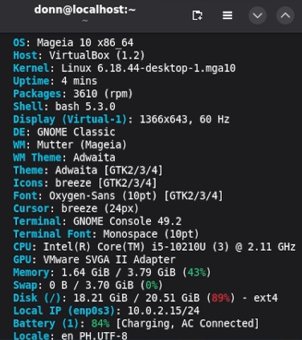
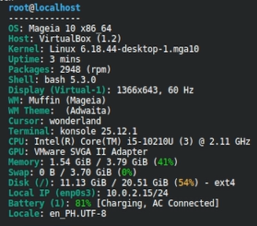
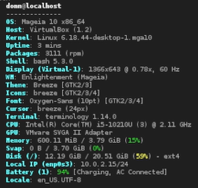

# Mageia Desktop Environment Installation

## Overview

After installing Mageia 10, three additional desktop environments were installed through the terminal:

* GNOME
* LXDE
* Enlightenment

Before verifying the desktop environments, I logged in as a sudoer, then `fastfetch` was installed to display system information and confirm the active desktop environment.

```bash
sudo urpmi fastfetch
```

---

## 1. GNOME

GNOME was installed using:

```bash
sudo urpmi task-gnome
```

The system was rebooted:

```bash
sudo reboot
```

GNOME was selected from the login screen and verified with:

```bash
fastfetch
```



---

## 2. LXDE

LXDE was installed using:

```bash
sudo urpmi task-lxde
```

The installation was verified with:

```bash
rpm -qa | grep -i lxde
```

The available desktop sessions were checked with:

```bash
ls /usr/share/xsessions/
```

### LXDE Session Troubleshooting

LXDE did not initially appear in the login session list. The active display manager was checked:

```bash
systemctl status sddm
systemctl is-enabled sddm
readlink -f /etc/systemd/system/display-manager.service
```

LightDM was then installed and configured:

```bash
urpmq lightdm
sudo urpmi lightdm
sudo systemctl enable lightdm
sudo systemctl disable sddm
sudo reboot
```

LXDE was then selected from the login screen and verified with:

```bash
fastfetch
```



---

## 3. Enlightenment

Enlightenment was installed using:

```bash
sudo urpmi task-enlightenment
```

The system was rebooted:

```bash
sudo reboot
```

Enlightenment was selected from the login screen and verified with:

```bash
fastfetch
```



---

## Summary

| Desktop Environment | Verification |
| ------------------- | ------------ |
| GNOME               | `fastfetch`  |
| LXDE                | `fastfetch`  |
| Enlightenment       | `fastfetch`  |
