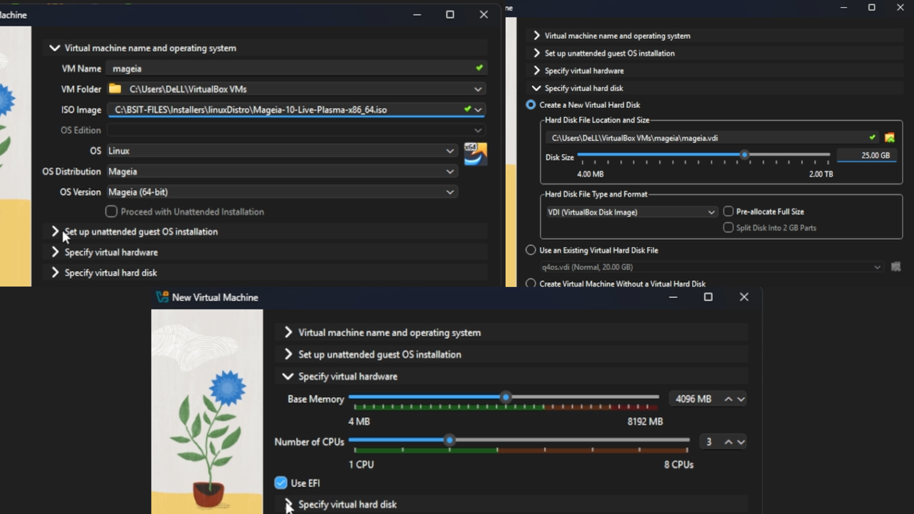
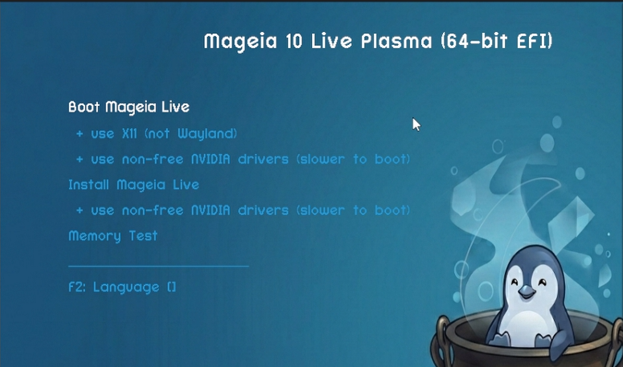
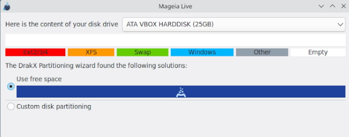
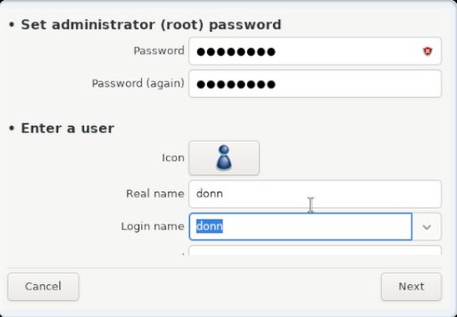
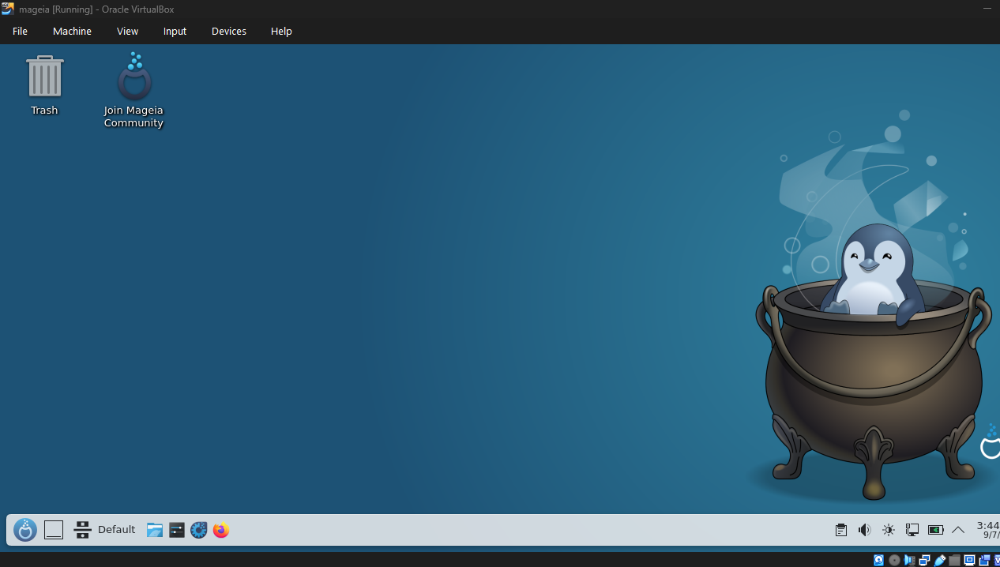

# Mageia 10 Installation

**Task:** Install Mageia 10 (Live Plasma edition) in VirtualBox to demonstrate Linux installation knowledge.

The installation covers VM setup, Live environment, disk partitioning, bootloader, user configuration, and first boot verification.

---

## 1. Virtual Machine Configuration

| Setting      | Value                   |
| ------------ | ----------------------- |
| OS           | Mageia 10 (Live Plasma) |
| Architecture | 64-bit                  |
| Memory       | 4 GB RAM                |
| Processors   | 3 CPU cores             |
| Storage      | 25 GB virtual disk      |
| Network      | NAT                     |

---

## 2. Boot the Live Environment

Mounted the Mageia 10 Live Plasma ISO and selected **Boot Mageia Live**.

* Boots directly into the Plasma desktop
* Launched the installer using **Install on Hard Disk**

---

## 3. Language, Location & Keyboard

Configured:

* Language
* Location
* Keyboard layout
* Time zone

---

## 4. Disk Partitioning

Used the DrakX partitioning tool and selected **Use free space** to automatically configure the virtual disk partitions.

**Shown:**

* Virtual disk
* Partition size
* Partition options

---

## 5. Package, Security & Bootloader Configuration

Configured:

* Package selection/removal
* Security settings
* Bootloader
* Package installation and updates

---

## 6. User Account & Hostname

| Field                 | Value    |
| --------------------- | -------- |
| Root Password         | . . .    |
| Root Password(again)  | . . .    |
| Real Name             | donn     |
| Login Name            | donn     |
| User Password         | . . .    |
| Password(again )      | . . .    |

---

## 7. Install Mageia

Reviewed the configuration and started the installation.

The installer copied the system to the virtual disk and applied the selected settings.

---

## 8. First Boot

Removed the installation media and restarted the VM.

**Result:** Mageia booted successfully into the Plasma desktop.

**Verified:**

* Mageia 10 installed
* Virtual disk is bootable
* System boots without installation media
* Plasma desktop is functioning

---

## Status: Installation Complete

Mageia 10 is installed and verified.
