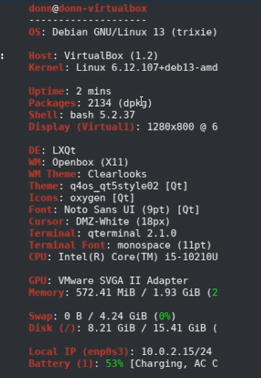
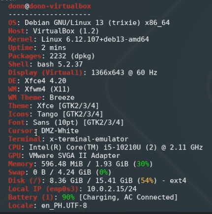
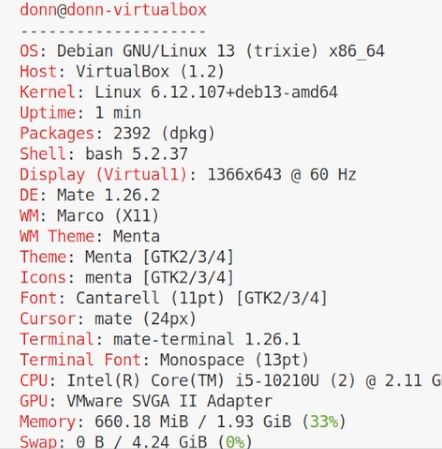

# Q4OS Desktop Environment Installation

## Overview

After the Q4OS installation, I installed three additional desktop environments through the terminal:

* LXQt
* Xfce
* MATE

Before verifying the desktop environments, I logged in as a sudoer, then `fastfetch` was installed to display system information and confirm the active desktop environment.

```bash
sudo apt update
sudo apt install fastfetch
```

---

## 1. LXQt

The LXQt desktop environment was installed with the following commands:

```bash
sudo apt update
sudo apt install task-lxqt-desktop
```

After the installation, Q4OS was rebooted using the command:

```bash
sudo reboot
```

LXQt was selected as the session at the login screen. After logging in, the terminal was opened and `fastfetch` was run to confirm that LXQt was running:

```bash
fastfetch
```



---

## 2. Xfce

Xfce was installed using the following commands:

```bash
sudo apt update
sudo apt install task-xfce-desktop
```

After the installation, Q4OS was rebooted:

```bash
sudo reboot
```

Xfce was selected from the login screen. After logging in, `fastfetch` was run to verify the active desktop environment:

```bash
fastfetch
```



---

## 3. MATE

MATE was installed using the following commands:

```bash
sudo apt update
sudo apt install task-mate-desktop
```

After the installation, Q4OS was rebooted:

```bash
sudo reboot
```

MATE was selected from the login screen. After logging in, `fastfetch` was run to confirm that MATE was running:

```bash
fastfetch
```



---

## Summary

All three desktop environments were installed through `apt` and confirmed working by logging into each session and checking the output of `fastfetch`.

| Desktop Environment | Verified With |
| ------------------- | ------------- |
| LXQt                | `fastfetch`   |
| Xfce                | `fastfetch`   |
| MATE                | `fastfetch`   |
