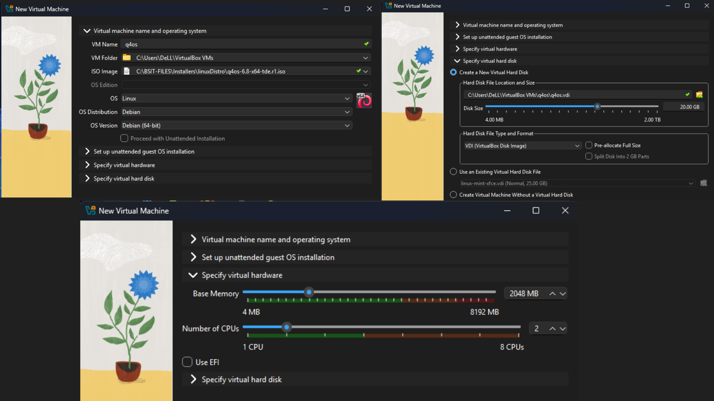
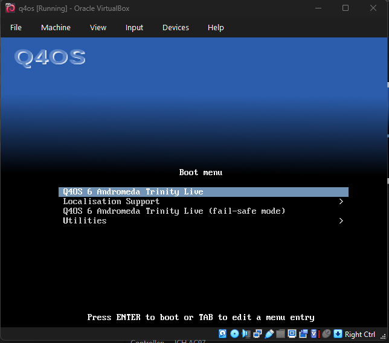
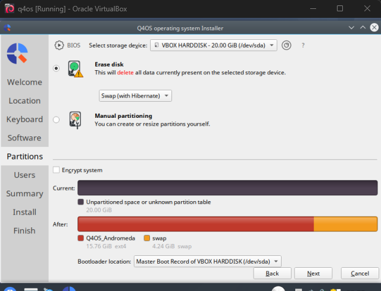
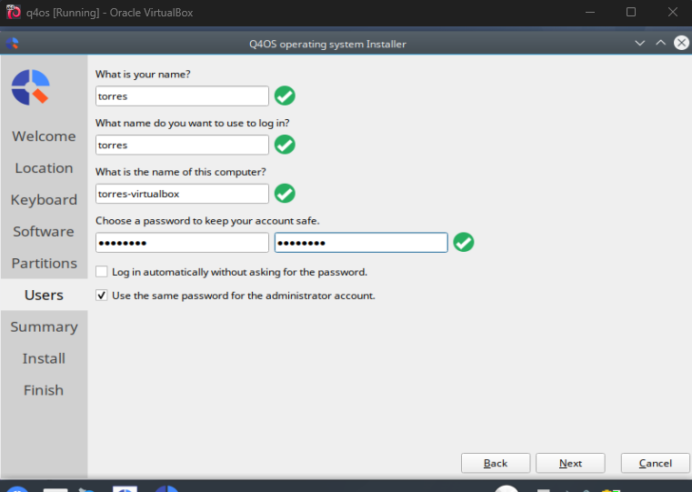
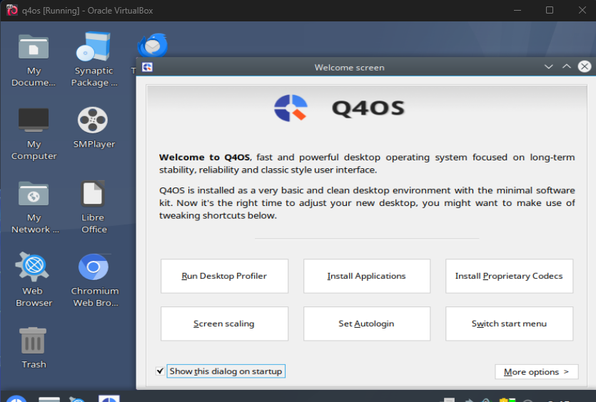

# Q4OS Installation

**Task:** Install Q4OS 6.8 (TDE) in VirtualBox to demonstrate Linux Installation knowledge.

The installation covers VM setup, disk partitioning, user configuration, and first boot verification.

---

## 1. Virtual Machine Configuration

| Setting      | Value              |
| ------------ | ------------------ |
| OS           | Q4OS 6.8 (TDE)     |
| Architecture | 64-bit             |
| Memory       | 2 GB RAM           |
| Processors   | 2 CPU cores        |
| Storage      | 20 GB virtual disk |
| Network      | NAT                |

---

## 2. Boot the Installer

Mounted the **q4os-6.8-x64-tde.r1.iso**, started the VM, and launched the installer from the boot menu.

---

## 3. Language, Location & Keyboard

Configured:

* Language
* Location
* Keyboard layout
* Time zone

---

## 4. Disk Partitioning

Used the installer's partitioning tool and selected **Erase Disk** to automatically partition the virtual disk.

**Shown:**

* Virtual disk
* Partition size
* Q4OS and swap partitions

---

## 5. User Account & Hostname

| Field      | Value  |
| ---------- | ------ |
| Name       | torres |
| Login Name | torres |
| Hostname   | torres-virtualbox |
| Password   | . . .  |
| Confirm Password | . . . |

---

## 6. Install Q4OS

Reviewed the settings and started the installation.

The installer copied the system to the virtual disk and configured the OS.

---

## 7. First Boot

Removed the installation media and restarted the VM.

**Result:** Q4OS booted successfully into the **Trinity Desktop Environment (TDE)**.

**Verified:**

* Q4OS installed
* Virtual disk is bootable
* System boots without installation media
* TDE desktop is functioning

---

## Status: Installation Complete

Q4OS 6.8 is installed and verified.
